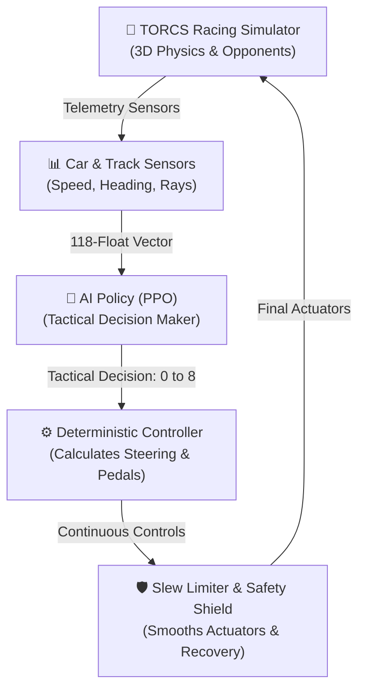

# TORCS AI

**TORCS AI** is a reinforcement learning research project where an AI agent learns high-level tactical driving decisions inside the TORCS (The Open Racing Car Simulator) environment. 

Instead of forcing a deep neural network to directly manipulate delicate steering angles and brake pedals at 50 frames per second, this project uses a **hierarchical architecture**: the AI agent decides *what strategy to take* (such as "move to the left lane and accelerate" or "stay centered and brake"), while a deterministic, handcrafted controller translates that decision into smooth continuous steering, throttle, and gear shifting.

---

## What this project does

In simple terms, this project connects Python code to a 3D racing simulator to train autonomous driving policies:

1. **The Simulator (TORCS)**: TORCS runs a simulated race on 3D tracks with realistic vehicle physics and computer-controlled opponent cars.
2. **Sensor Stream**: Over a local network connection (UDP), TORCS continuously sends the car's current status (speed, engine RPM, distance from track edges, distances to nearby opponents, etc.).
3. **The AI Agent (PPO)**: A neural network trained with Proximal Policy Optimization (PPO) looks at this sensor data and picks one of **9 tactical driving actions**.
4. **The Deterministic Controller**: Reliable Python control code receives the AI's tactical intention and computes the exact physical steering angle, gas pedal percentage, brake pressure, and gear change.
5. **Safety & Execution**: An actuator limiter ensures the car never pushes the gas and brake at the same time, while an emergency recovery shield steps in if the car begins spinning out. The physical controls are sent back to TORCS to complete the loop.



---

## Why I built it this way

### Direct Control vs. Hierarchical Control
In many standard machine learning projects, a neural network is asked to control everything directly:
- **Direct End-to-End Control**: The neural network outputs continuous numbers for steering ($-1.0$ to $+1.0$), gas ($0.0$ to $1.0$), and brake ($0.0$ to $1.0$). If the network makes a tiny mistake, the car violently swerves, spins out, or oscillates wildly. Learning both *how to balance a car* and *how to race tactically* at the same time is extremely sample-inefficient.
- **Hierarchical Control (Our Approach)**: We split the problem into two distinct jobs:
  1. **The AI's Job**: High-level tactical judgment (*"Which lane should I be in?"*, *"Should I push hard or slow down for traffic?"*).
  2. **The Control Code's Job**: Low-level vehicle dynamics (*"How much steering angle is required to reach that lane smoothly?"*, *"When should the transmission shift gears?"*).

### Key Benefits
- **Faster, More Stable Training**: The AI solves a discrete 9-choice problem instead of searching through an infinite space of chaotic pedal combinations.
- **Safer Exploration**: The car stays on the track much more reliably during the initial learning stages.
- **Scientific Attribution**: We can clearly differentiate between what the neural network actually learned versus what was handled by classical control engineering. We never pretend that handcrafted steering math was "invented" by the AI.

---

## The 9 Actions

At every decision step, the AI policy outputs a single integer from `0` to `8`. It never directly outputs a continuous steering angle or pedal position.

| Action ID | Lane Target | Speed Target | Description |
| :---: | :---: | :---: | :--- |
| `0` | **Left Lane** | **Brake** (65% speed limit) | Move toward the left side of the track while slowing down |
| `1` | **Left Lane** | **Maintain** (85% speed limit) | Move toward the left side of the track at cruising speed |
| `2` | **Left Lane** | **Push** (100% speed limit) | Move toward the left side of the track at maximum acceleration |
| `3` | **Center Lane** | **Brake** (65% speed limit) | Hold the center racing line while slowing down |
| `4` | **Center Lane** | **Maintain** (85% speed limit) | Hold the center racing line at cruising speed |
| `5` | **Center Lane** | **Push** (100% speed limit) | Hold the center racing line at maximum acceleration |
| `6` | **Right Lane** | **Brake** (65% speed limit) | Move toward the right side of the track while slowing down |
| `7` | **Right Lane** | **Maintain** (85% speed limit) | Move toward the right side of the track at cruising speed |
| `8` | **Right Lane** | **Push** (100% speed limit) | Move toward the right side of the track at maximum acceleration |

---

## What the AI sees

Before making each decision, the agent receives a numeric snapshot describing its environment. Because neural networks require a fixed-size list of numbers, all raw simulator values are normalized into a fixed list of **118 decimal numbers (`float32`)**:

1. **Car Movement & Heading (5 values)**: Forward speed, sideways sliding speed, engine RPM, car orientation relative to the track direction, and distance from the track center.
2. **Track Boundary Distance Rays (19 values)**: 19 rangefinder sensors pointing in an arc from left to right, measuring the distance to the edge of the asphalt (up to 200 meters).
3. **Opponent Proximity Rays (36 values)**: 36 surrounding sensors measuring the distance to opponent cars in all directions ($360^\circ$).
4. **Opponent Closing Rates (36 values)**: How fast nearby opponent cars are approaching or moving away.
5. **Traffic Clearance Summary (3 values)**: Quick summaries of available space in the left, center, and right lanes.
6. **Wheel Rotation & Slip (4 values)**: Rotational speed of each of the 4 wheels to detect wheel spin and loss of grip.
7. **Collision Damage (1 value)**: Change in vehicle damage since the previous step.
8. **Previous Controls (3 values)**: The steering, throttle, and brake applied in the last step to ensure continuity.
9. **Race Context (11 values)**: Current lap progress, race position, and track sector data.

*When sensors cannot see a track edge or opponent, they report a safe default value ($-1.0$), ensuring the network never receives corrupt or `NaN` inputs.*

---

## How the agent learns

### Reinforcement Learning in Plain English
In standard machine learning (supervised learning), you give the computer a dataset of correct answers. In **reinforcement learning (RL)**, there is no answer key. The car drives in the simulator, experiences the consequences of its decisions, and receives a numeric score (called a **reward**):
- **Positive Rewards (+)**: Making forward progress down the track, completing race laps, and gaining race positions.
- **Negative Penalties (-)**: Driving off the track, sliding sideways out of control, colliding with walls or opponents, or getting stuck.
- **Finish Bonus (+100)**: Successfully completing a full race.
- **Terminal Crash Penalty (-100)**: Severe crashes that end the run early.

### What is PPO?
**PPO (Proximal Policy Optimization)** is the reinforcement learning algorithm used to update the neural network. As the car collects experience, PPO makes small, mathematically constrained adjustments to the network's weights. The "proximal" part ensures the policy improves gradually rather than taking massive, reckless optimization steps that could ruin previously learned driving skills.

---

## Behavioural cloning / teacher warm start

Starting reinforcement learning completely from scratch means the agent begins with random guesses, often crashing into the nearest wall for the first hundred episodes.

To speed up early learning, the repository includes an optional **Behavioural Cloning (BC)** warm start:
1. A handcrafted, rule-based "expert teacher" controller drives the car around the track.
2. We record the teacher's tactical decisions into a demonstration dataset.
3. The PPO neural network is pre-trained to imitate the teacher's tactical choices before exploring on its own.

> [!IMPORTANT]
> **Research Integrity Rule**: Teacher guidance is used **only during training**. During all final benchmark evaluations, teacher guidance is strictly disabled ($0.0$). We never credit the teacher's deterministic driving ability to the PPO neural network.

---

## The safety shield

Real autonomous vehicles and advanced robotics use safety fallbacks to prevent catastrophic hardware damage. This project implements an explicit **Recovery Safety Shield**:

- If the car goes dangerously off-track ($|\text{track position}| \ge 1.15$),
- If the car spins into a dangerous angle relative to the road ($|\text{angle}| \ge 0.65\text{ rad}$ or $\approx 37^\circ$),
- Or if the car gets pushed backward ($\text{speed} < -2.0\text{ m/s}$),

The safety shield temporarily overrides the AI's action to steer back onto the asphalt and recover vehicle heading.

### Transparency & Auditing
Every single time the safety shield intervenes, the event is logged into the race telemetry (`shield_intervened = True`, along with the specific trigger reason). When evaluating an agent, we track **Shield Interventions per Kilometer**. A policy that constantly relies on the safety shield is penalized and flagged—the shield's saves are never hidden as "AI skill."

---

## Training, validation and test tracks

Just like splitting a dataset into Training, Validation, and Test sets in standard machine learning, racing tracks are partitioned into three strictly separated roles:

```
┌──────────────────────────────────────┬────────────────────────┬──────────────────────────────────────┐
│           TRAINING TRACKS            │    VALIDATION TRACK    │          HELD-OUT TEST TRACKS        │
│          (Agent Learns Here)         │   (Tuning & Decisions) │         (Final Evaluation Only)      │
├──────────────────────────────────────┼────────────────────────┼──────────────────────────────────────┤
│ • road/alpine-1 (Technical road)     │ • road/ruudskogen      │ • road/spring   (Unseen elevation)   │
│ • road/forza    (High-speed street)  │                        │ • road/street-1 (Unseen tight city)  │
│ • oval/michigan (High-speed oval)    │                        │                                      │
└──────────────────────────────────────┴────────────────────────┴──────────────────────────────────────┘
```

- **Training Tracks**: Used by PPO to update neural network weights.
- **Validation Track**: Used to check progress and tune training settings without peeking at the final test.
- **Held-Out Test Tracks**: The agent **never trains on these tracks**. They test whether the AI learned general racing principles or merely memorized the curves of the training track.
- **Contamination Guard**: The training software automatically aborts with an error if someone accidentally attempts to train on a held-out test track.

---

## Current results

### The Honest Status
**The engineering pipeline is complete and fully verified, but the current documented PPO model is only smoke-trained (5,000 steps) and is not yet a competitive racing agent.**

Training a championship-level reinforcement learning racing agent requires hundreds of thousands of simulation steps. The initial short training run was conducted to verify that:
1. The isolated TORCS runtime stages and executes cleanly on Windows.
2. Telemetry and tactical control packets flow without latency or socket timeouts.
3. Neural network inference runs in under 1 millisecond ($p50 \approx 0.7\text{ ms}$), well inside the 20 ms real-time control budget.
4. Checkpoints, SHA-256 hashes, and reproducibility manifests are saved automatically.

### Detailed Benchmark Results (5,000-Step Validation Run)

The table below compares the short-trained PPO agent against a **Fixed Center Baseline** (an agent that only chooses action `4`: center + maintain) and the **Handcrafted Expert Teacher**:

| Track | Track Role | Controller / Agent | Finish Rate | Med Position | Damage/km | Shield/km | Dominant Action % | Action Collapsed? | Inference Latency (p50) |
| :--- | :--- | :--- | :---: | :---: | :---: | :---: | :---: | :---: | :---: |
| `road/alpine-1` | **Training** | **Learned PPO** | 0% | 1.0 | 1188.3 | 0.0 | 58.9% | **NO** | **0.79 ms** |
| `road/alpine-1` | Training | **Fixed Center** | 0% | 1.0 | 987.9 | 35.7 | 100.0% | **YES** | 0.00 ms |
| `road/alpine-1` | Training | **Expert Teacher**| 0% | 1.0 | 885.1 | 0.0 | 58.2% | **NO** | 0.07 ms |
| `road/ruudskogen` | **Validation** | **Learned PPO** | 0% | 1.0 | 0.0 | 17.9 | 75.0% | **NO** | **0.69 ms** |
| `road/ruudskogen` | Validation | **Fixed Center** | 0% | 1.0 | 0.0 | 15.4 | 100.0% | **YES** | 0.00 ms |
| `road/ruudskogen` | Validation | **Expert Teacher**| 0% | 1.0 | 0.0 | 18.2 | 69.6% | **NO** | 0.07 ms |
| `road/spring` | **Held-Out Test** | **Learned PPO** | 0% | 1.0 | 0.0 | 1.8 | 59.6% | **NO** | **0.72 ms** |
| `road/spring` | Held-Out Test | **Fixed Center** | 0% | 1.0 | 0.0 | 1.3 | 100.0% | **YES** | 0.00 ms |
| `road/spring` | Held-Out Test | **Expert Teacher**| 0% | 1.0 | 0.0 | 1.8 | 55.8% | **NO** | 0.05 ms |
| `road/street-1` | **Held-Out Test** | **Learned PPO** | 0% | 1.0 | 517.2 | 5.3 | 50.9% | **NO** | **0.64 ms** |
| `road/street-1` | Held-Out Test | **Fixed Center** | 0% | 1.0 | 481.8 | 97.3 | 100.0% | **YES** | 0.00 ms |
| `road/street-1` | Held-Out Test | **Expert Teacher**| 0% | 1.0 | 354.2 | 8.5 | 53.2% | **NO** | 0.06 ms |

### Metric Definitions
- **Finish Rate**: Percentage of races where the car crossed the finish line without timing out or retiring.
- **Damage/km**: Total collision damage accumulated divided by total kilometers driven.
- **Shield/km**: Number of emergency safety shield interventions per kilometer.
- **Dominant Action %**: The percentage of time the agent spent choosing its single most frequent action.
- **Action Collapsed**: A critical failure in RL where an agent gets stuck choosing only one action (e.g., 100% center). The PPO model maintained healthy action diversity ($50.9\%\text{--}75.0\%$) and did **not** collapse.
- **Inference Latency (p50)**: Median time required for the neural network to process an observation and return an action on CPU.

---

## What is already working

- [x] **Isolated Native TORCS Runtime**: Staging harness copies simulation assets into `.runtime/` and treats the base Windows simulator directory as strictly read-only.
- [x] **Gymnasium Contract Compliance**: Full support for standard `reset()` and `step()` returning `(obs, reward, terminated, truncated, info)`, passing `gymnasium.utils.env_checker.check_env`.
- [x] **118-Dimensional Telemetry Encoder**: Normalized, finite, sentinel-safe observation encoding (`float32`).
- [x] **9-Action Tactical Decision Layer**: Discrete high-level intention abstraction.
- [x] **Deterministic Actuator Limiter**: Slew-rate limiting with physical throttle/brake mutual exclusion.
- [x] **Transparent Safety Recovery Shield**: Rule-based spin recovery with full telemetry auditing.
- [x] **Behavioural Cloning Bootstrap**: Pre-training pipeline from expert demonstration datasets.
- [x] **Contamination-Guarded Track Roles**: Enforced separation between training, validation, and held-out test tracks.
- [x] **Atomic Checkpoints & Manifests**: SHA-256 integrity digest files and complete run provenance metadata (`manifest.json`).
- [x] **Statistical Rigor**: 95% percentile bootstrap confidence intervals and Interquartile Mean (IQM) evaluation reporting.
- [x] **Automated Test Suite**: 115 passing unit and contract tests with **82.28% statement coverage** (exceeding the 80% CI threshold).
- [x] **Static Analysis**: 100% passing Ruff linter, Ruff formatting, and Mypy static type checking across all 59 repository files.
- [x] **Continuous Integration (CI)**: Fully passing GitHub Actions workflow on Python 3.11 and 3.12.
- [x] **Native Windows Release Gate**: Automated PowerShell script (`scripts/verify_native_release.ps1`) verifying simulator process ownership and filesystem immutability.

---

## How the code is organised

```text
torcs_ai/
├── controllers/      # Handcrafted control: tactical action mapping, slew limiter, expert teacher, and safety shield
├── envs/             # Gymnasium environments: telemetry encoder, RacingEnv, and MultiTrackRacingEnv
├── runtime/          # Simulator process management: staging sandboxes, XML race configs, and process lifetime
├── imitation.py      # Behavioural cloning and expert demonstration dataset collector
├── rl.py             # PPO training pipeline, atomic checkpointing, bootstrap CI, and latency profiling
└── client.py         # Low-level UDP socket client for TORCS SCR protocol

scripts/
├── torcs_doctor.py           # Read-only validator for installed TORCS binary and assets
├── native_smoke.py           # Quick sanity check running an isolated native race
├── train_native_agent.py     # Main PPO training entry point with BC warm start
├── evaluate_native_agent.py  # Teacher-free evaluation script for saved checkpoints
├── benchmark_native.py       # Multi-track benchmark runner generating Markdown & JSON reports
└── verify_native_release.ps1 # Local release gate script verifying process cleanup and immutability

tests/                # 115 comprehensive unit, contract, and mock environment tests
```

---

## Running the project

### 1. Install Python dependencies
Clone the repository and install it in editable mode with reinforcement learning tools:

```powershell
# Create and activate a virtual environment (Python 3.11 or 3.12)
python -m venv .venv
.\.venv\Scripts\Activate.ps1

# Upgrade pip and install package with RL, developer, and analysis tools
python -m pip install --upgrade pip
python -m pip install -e ".[dev,rl,viz,analysis]"
```

### 2. Verify TORCS installation
Check that your local Windows TORCS installation is present and undamaged (default path: `C:\torcs\torcs`):

```powershell
python scripts\torcs_doctor.py --torcs-home C:\torcs\torcs
```

### 3. Run the native smoke test
Run a quick 500-step test to verify that an isolated runtime sandbox launches and connects successfully:

```powershell
python scripts\native_smoke.py --torcs-home C:\torcs\torcs --steps 500
```

### 4. Train an agent
Train a PPO agent on `road/alpine-1` with an expert demonstration warm start:

```powershell
python scripts\train_native_agent.py `
    --torcs-home C:\torcs\torcs `
    --track road/alpine-1 `
    --timesteps 100000 `
    --max-steps 15000 `
    --expert-episodes 1 `
    --bc-epochs 8 `
    --output runs\ppo_experiment
```

### 5. Evaluate an agent
Evaluate a saved checkpoint on a test track without teacher guidance:

```powershell
python scripts\evaluate_native_agent.py `
    --torcs-home C:\torcs\torcs `
    --model runs\ppo_experiment\model.zip `
    --track road/spring `
    --episodes 3 `
    --max-steps 10000
```

---

## Testing and engineering quality

This repository follows strict software engineering and testing practices to prevent silent bugs:

- **Gymnasium Contract Tests**: Ensures observation spaces, action spaces, reset formats, and step tuples comply with modern Gymnasium standards.
- **Physical Safety Tests**: Verifies that the actuator limiter strictly prevents concurrent throttle and brake application.
- **Observation Integrity Tests**: Ensures no `NaN`, infinite, or out-of-bounds numbers enter the neural network.
- **Contamination Tests**: Asserts that training scripts reject held-out test tracks.
- **Checkpoint Hashing**: Verifies that saved model `.zip` archives match their computed SHA-256 checksums.

Run all quality checks locally:

```powershell
# 1. Code style and formatting
ruff check .
ruff format --check .

# 2. Static type checking
mypy torcs_ai scripts tests

# 3. Unit test suite with code coverage floor
pytest
```

---

## Limitations

- **Research-Stage Agent**: The currently documented model is an initial validation smoke run and does not yet complete full races competitively.
- **Hierarchical Dependency**: Because low-level continuous steering is calculated by classical control code, vehicle performance is a combination of AI tactical decision-making and handcrafted actuator mathematics. This is not an end-to-end pixel-to-torque model.
- **Windows Simulator Runtime**: Running the full 3D physics simulation currently requires a local Windows installation of TORCS with the `scr_server.dll` patch.

---

## What I would improve next

1. **Large-Scale Multi-Track Training**: Scale PPO training to $1,000,000\text{--}5,000,000$ steps across all three training tracks simultaneously (`alpine-1`, `forza`, `michigan`).
2. **Dense Traffic Curriculum**: Train the agent gradually, starting with solo time trials, progressing to single-car overtaking, and finishing with 10-car championship grids.
3. **Continuous-Control Comparison**: Benchmark this discrete 9-action tactical architecture against continuous Soft Actor-Critic (SAC) and Twin Delayed DDPG (TD3) policies.
4. **Automated Dynamic Slew Rates**: Allow the low-level controller to dynamically adjust steering slew rates based on current lateral tire slip angle.

---

## Technical details for experienced readers

<details>
<summary><b>Click to expand detailed mathematical and architectural specifications</b></summary>

### Version Identifiers
- **Telemetry Schema**: `competitive-telemetry-v1` (118 floats, `[-1.0, 1.0]` normalized range, `-1.0` unobserved sentinel).
- **Tactical Action Schema**: `tactical-grid-v1` (Discrete 9: $\{-0.6, 0.0, 0.6\} \times \{0.65, 0.85, 1.0\}$).
- **Reward Function**: `progress-position-safety-teacher-v3`.

### Reward Formulation
$$R_t = \Delta d_{\text{progress}} + 0.5 \cdot \Delta p_{\text{race}} + R_{\text{finish}} - (R_{\text{track}} + R_{\text{angle}} + R_{\text{slip}} + R_{\text{damage}}) + R_{\text{teacher}}$$

Where:
- $\Delta d_{\text{progress}} = \text{clip}(d_t - d_{t-1}, -5.0, 5.0)$
- $\Delta p_{\text{race}} = \text{clip}(\text{pos}_{t-1} - \text{pos}_t, -2.0, 2.0)$
- $R_{\text{track}} = 0.35 \cdot (\text{trackPos})^2$
- $R_{\text{angle}} = 0.20 \cdot |\theta_{\text{heading}}|$
- $R_{\text{slip}} = 0.02 \cdot |v_y|$
- $R_{\text{damage}} = \min(0.10 \cdot \Delta \text{damage}, 100.0)$
- $R_{\text{finish}} = +100.0$ (upon race completion)
- $R_{\text{failure}} = -100.0$ (upon terminal off-track, backwards driving, or terminal damage)
- $R_{\text{teacher}} = \lambda_{\text{teacher}} \cdot (\mathbb{I}[a_t = a^*_{\text{teacher}}] - \mathbb{I}[a_t \neq a^*_{\text{teacher}}])$, with $\lambda_{\text{teacher}} = 0.0$ during evaluation.

### Safety Shield Thresholds
- Emergency recovery triggers when $|\text{trackPos}| \ge 1.15$, $|\theta_{\text{heading}}| \ge 0.65\text{ rad}$, or $v_x < -2.0\text{ m/s}$.
- Steers counter to heading error ($1.8 \cdot \theta$) and toward track centerline ($-0.8 \cdot \text{trackPos}$), setting throttle to $0.0$ and applying $0.3$ brake when heading error exceeds $0.8\text{ rad}$.

### Statistical Reporting
- **Interquartile Mean (IQM)**: $25\%$ trimmed mean computed across independent rollout returns to resist outlier skew.
- **Bootstrap Confidence Intervals**: $95\%$ percentile bootstrap with $1,000$ resamples over independent episode seeds.

</details>
